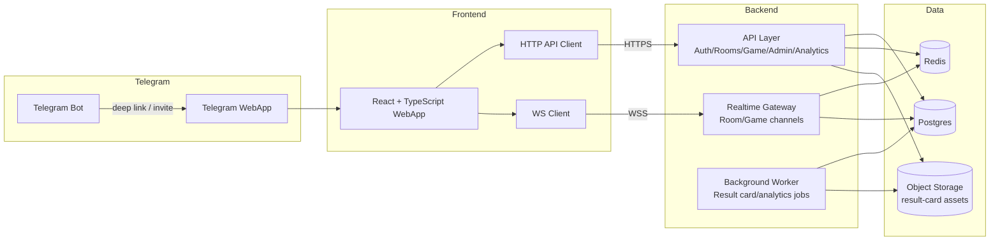
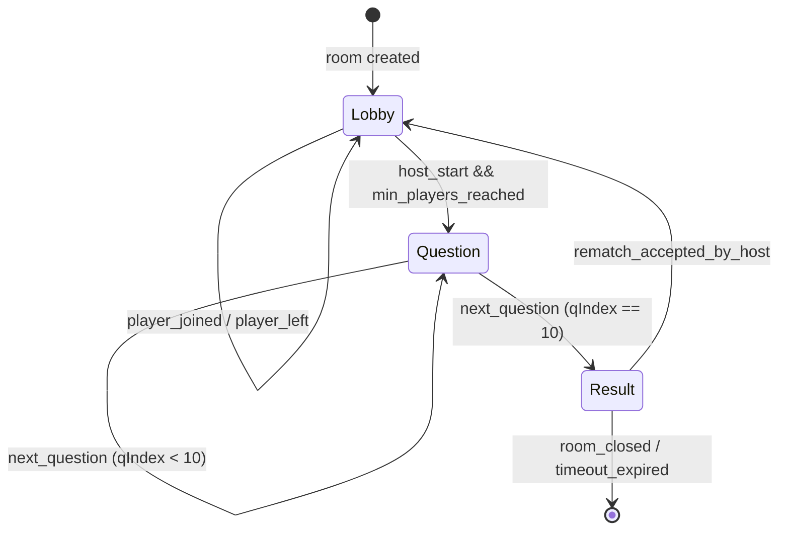
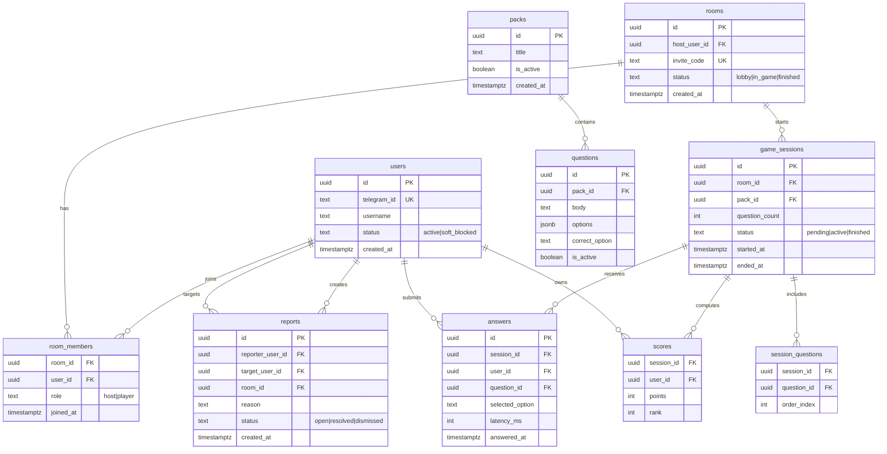

# Solution Design v1 (Story 1.2)

## 1) Architecture diagram (WebApp/API/DB/Redis/WS/Bot)

### Responsibilities split

- **WebApp (Dev B):** lobby/game/result/admin UI, state rendering, WS reconnect UX.
- **API + WS (Dev A):** auth, room lifecycle, game orchestration, server scoring, reports/blocks, analytics events.
- **Data layer:**
  - **Postgres** — source of truth for users/rooms/sessions/answers/reports.
  - **Redis** — transient state, rate limits, WS fan-out support.
  - **Object storage** — generated result cards.

## 2) Game state machine (lobby → question → result → rematch)

### State rules

- `host_start` валиден только для роли `host`.
- В `Question` каждый `answer_submitted` идемпотентен по `(sessionId, userId, questionId)`.
- Переход в `Result` выполняется только после серверной фиксации очков.
- `rematch_accepted_by_host` создаёт новый `game_session_id`, но сохраняет room context.

## 3) ERD + migration gaps review

## 3.1 ERD (MVP-level)

## 3.2 Migration gaps (checklist)

- [ ] `users.telegram_id` unique index.
- [ ] `rooms.invite_code` unique index.
- [ ] Composite unique constraint on `room_members (room_id, user_id)`.
- [ ] Composite unique constraint on `answers (session_id, user_id, question_id)` for idempotency.
- [ ] Composite unique constraint on `scores (session_id, user_id)`.
- [ ] Foreign key cascade policy review (`game_sessions`/`answers`/`scores`).
- [ ] Partial indexes for active entities (`packs.is_active`, `questions.is_active`).
- [ ] Audit fields where needed (`updated_at`, optional `deleted_at`).

## 4) API/WS contracts draft (Markdown)

## 4.1 REST API (draft)

| Method | Endpoint | Purpose | Request (key fields) | Response (key fields) |
|---|---|---|---|---|
| `POST` | `/auth/telegram` | Verify `initData` and create session | `initData` | `accessToken`, `user` |
| `POST` | `/rooms` | Create room | `packId` (optional) | `roomId`, `inviteCode`, `host` |
| `POST` | `/rooms/{roomId}/join` | Join by invite/room id | `inviteCode` (alt) | `room`, `member` |
| `POST` | `/rooms/{roomId}/start` | Start game (host-only) | — | `sessionId`, `status=active` |
| `GET` | `/rooms/{roomId}` | Get lobby snapshot | — | `room`, `members`, `status` |
| `GET` | `/sessions/{sessionId}/result` | Final scoreboard | — | `scores`, `winner`, `resultCardUrl` |
| `POST` | `/sessions/{sessionId}/rematch` | Start rematch in same room | — | `newSessionId` |
| `POST` | `/reports` | Submit abuse report | `targetUserId`, `reason`, `roomId` | `reportId`, `status=open` |
| `POST` | `/admin/users/{userId}/soft-block` | Apply/revoke soft block | `blocked: boolean` | `userId`, `status` |

### Error model

- `400` validation failure.
- `401` invalid or expired auth.
- `403` forbidden action (e.g., non-host start).
- `404` room/session not found.
- `409` conflicting state transition.
- `429` rate limit exceeded.

## 4.2 WebSocket contracts (draft)

### Client → server

- `room.join` `{ roomId }`
- `room.leave` `{ roomId }`
- `game.start` `{ roomId }` (host-only)
- `game.answer.submit` `{ sessionId, questionId, selectedOption, answeredAt }`
- `game.rematch.request` `{ sessionId }`

### Server → client

- `room.state.updated` `{ roomId, status, members, hostUserId }`
- `game.started` `{ sessionId, questionCount, startedAt }`
- `game.question` `{ sessionId, questionId, orderIndex, body, options, ttlMs }`
- `game.answer.ack` `{ sessionId, questionId, accepted, duplicate }`
- `game.score.updated` `{ sessionId, userId, points }`
- `game.finished` `{ sessionId, scores, winnerUserId, resultCardUrl }`
- `system.warning` `{ code, message }`

### WS reliability rules

- Все mutating события подтверждаются `ack`.
- Повторная отправка `game.answer.submit` для того же вопроса возвращает `duplicate=true`.
- При reconnect клиент запрашивает `room.state.updated` и текущий вопрос через snapshot endpoint/API.

## 5) Wireflow + UI states (Dev B)

## 5.1 Core wireflow

1. **Entry / Auth gate**
2. **Home** (create room / join room)
3. **Lobby** (member list, invite CTA, start button for host)
4. **Question screen** (timer, options, lock-on-answer)
5. **Inter-question transition** (short scoreboard)
6. **Final result** (rank + points)
7. **Result card preview**
8. **Rematch confirmation**
9. **Share entry point**
10. **Report modal/flow**
11. **Admin MVP screens** (dashboard, content, reports)

## 5.2 Required UI states per key screen

- **Loading:** skeleton/spinner for initial data and transitions.
- **Empty:** no rooms, no reports, no content items.
- **Error:** recoverable error with retry CTA.
- **Disconnected:** WS dropped, show reconnect state and disable answer submit.
- **Expired:** invite expired / session finished / auth token expired.

## 5.3 Acceptance notes for UI states

- Любой блокирующий state должен иметь понятный CTA (`Retry`, `Back to Lobby`, `Re-auth`).
- Для `Disconnected` нельзя позволять "молчаливую" отправку ответов.
- Для `Expired` показывается причина и следующий валидный шаг пользователя.

## 6) Dependency mapping for Story 1.2 tasks

- **1.2.1 Architecture diagram** ← depends on **1.1.1 scope contract**.
- **1.2.2 Game state machine** ← depends on **1.1.1 scope contract**.
- **1.2.3 ERD + migration gaps review** ← depends on **1.1.1 scope contract**.
- **1.2.4 API/WS contracts draft** ← depends on **1.2.2 + 1.2.3**.
- **1.2.5 Wireflow + UI states** ← depends on **1.1.1 scope contract**.
